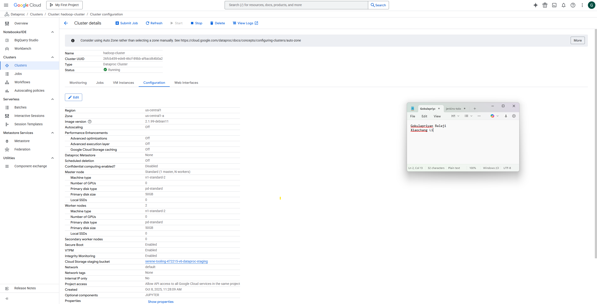
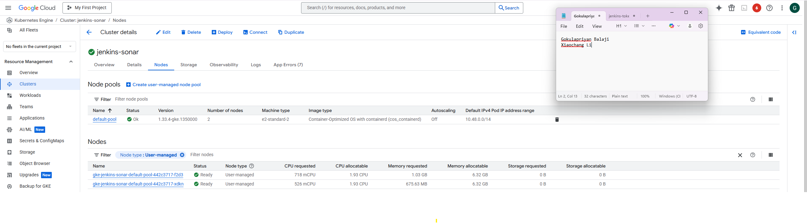
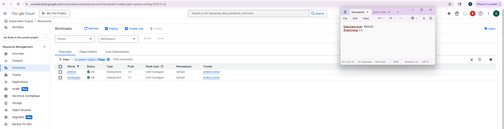
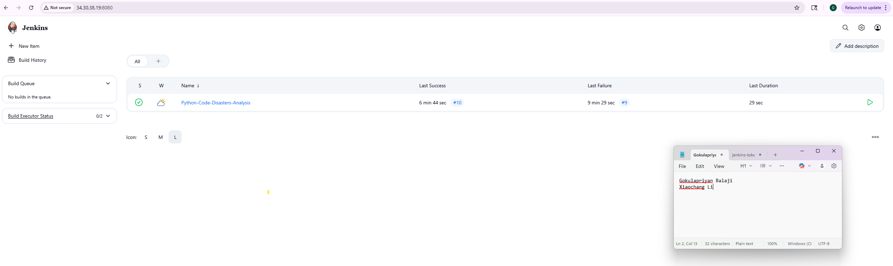
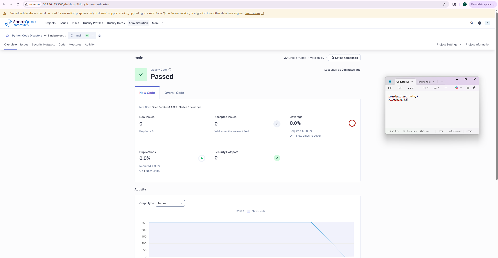
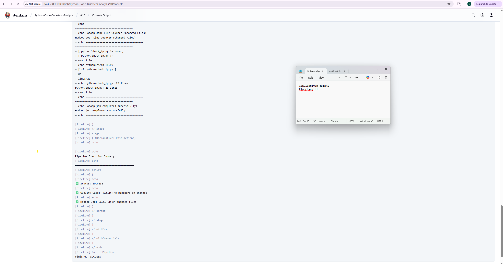
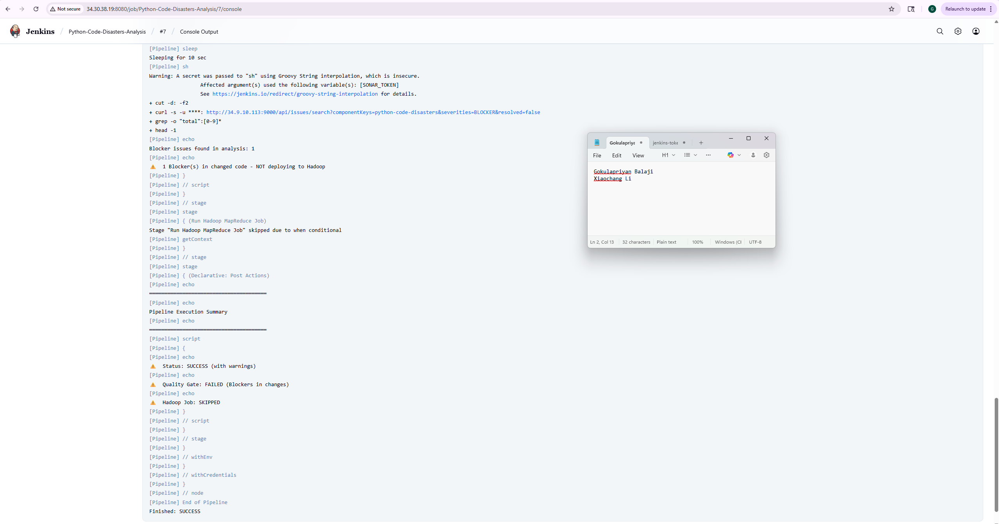

# Code Quality and Hadoop Processing Workflow

**Course Project - Option 1**

**Team Members:** Gokulapriyan Balaji, Xiaochang Li

---

## Project Overview

This project establishes an automated workflow that checks code quality and conditionally runs processing jobs based on the quality assessment results.

### Workflow Architecture

```
Code push to GitHub → Jenkins triggers → SonarQube analysis
                              ↓
      No critical issues → Run Hadoop job
      Critical issues found → Skip Hadoop job
```

### Prerequisites

**Required Accounts:**
- Google Cloud Platform account
- GitHub account

---

## Basic Setup

### Configure Default Project and Region

```bash
# Configure default project and region
gcloud config set project YOUR_PROJECT_ID
gcloud config set compute/region us-central1
gcloud config set compute/zone us-central1-a

# Enable required services
gcloud services enable compute.googleapis.com
gcloud services enable container.googleapis.com
gcloud services enable dataproc.googleapis.com
```

---

## Implementation Steps

### 1. Create Hadoop Cluster

Create a Dataproc cluster via GCP Console with the following specifications:

- **Name:** hadoop-cluster
- **Region:** us-central1
- **Configuration:** 1 master node + 2 worker nodes
- **Machine type:** n1-standard-2

### 2. Create Kubernetes Cluster

```bash
gcloud container clusters create jenkins-sonar \
  --machine-type e2-standard-2 \
  --num-nodes 2 \
  --zone us-central1-a
```

### 3. Deploy Jenkins and SonarQube

Deploy using basic Kubernetes manifests:

```bash
kubectl apply -f jenkins-deployment.yaml
kubectl apply -f jenkins-service.yaml
kubectl apply -f sonarqube-deployment.yaml
kubectl apply -f sonarqube-service.yaml
```

Get access URLs:

```bash
kubectl get service jenkins
kubectl get service sonarqube
```

### 4. Initial Configuration

#### Jenkins Setup

1. Access `http://JENKINS_IP:8080`
2. Use initial admin password
3. Install suggested plugins
4. Create admin account

#### SonarQube Setup

1. Access `http://SONARQUBE_IP:9000`
2. Login with `admin/admin`
3. Change password
4. Create project and generate token

### 5. Integration Setup

Configure Jenkins with the following steps:

1. Add SonarQube token credentials
2. Configure SonarQube server settings
3. Install necessary plugins

### 6. Create Freestyle Project

#### Project Configuration

- **Type:** Freestyle project
- **GitHub project URL:** Your repository address
- **Build triggers:** GitHub hook trigger
- **Build environment:** Prepare SonarQube scanner

---

## Validation

Test the workflow functionality to ensure proper operation:

- **Test 1:** Push clean code → Should trigger Hadoop job
- **Test 2:** Push problematic code → Should skip Hadoop job

---

## Intergrate with hadoop

To enable seamless communication between Jenkins and the Hadoop cluster, we will utilize the Jenkins Hadoop plugin. This plugin provides built-in support for Hadoop operations. For our Google Cloud Dataproc cluster, we will use the master node's external IP and ensure proper network connectivity. The plugin also supports credential management for secure access. Once configured, the Jenkins job can invoke Hadoop commands or run MapReduce jobs as part of the build steps, completing the automated workflow where quality gates control Hadoop job execution.

---

## Screenshot
### Hadoop

- Dataproc cluster dashboard showing the hadoop-cluster in "Running" state
- Cluster details showing:
  - 1 Master node (n1-standard-2)
  - 2 Worker nodes (n1-standard-2)
  - Region: us-central1
  - Zone: us-central1-a



### Kubernetes

- GKE cluster dashboard showing jenkins-sonar-cluster in "Running" state




### Jenkins with Repo Forked

- Jenkins dashboard showing the Python-Code-Disasters-Analysis pipeline



### SonarQube

- SonarQube dashboard showing the python-code-disasters project



### Jenkins

- No block case




- Block case



## References

### Official Documentation

1. **Google Cloud Platform**
   - Dataproc Documentation: https://cloud.google.com/dataproc/docs
   - Google Kubernetes Engine (GKE) Documentation: https://cloud.google.com/kubernetes-engine/docs
   - gcloud CLI Reference: https://cloud.google.com/sdk/gcloud/reference

2. **Jenkins**
   - Jenkins Official Documentation: https://www.jenkins.io/doc/
   - Jenkins Docker Image: https://hub.docker.com/r/jenkins/jenkins
   - Jenkins Pipeline Syntax: https://www.jenkins.io/doc/book/pipeline/syntax/
   - SonarQube Scanner for Jenkins: https://plugins.jenkins.io/sonar/

3. **SonarQube**
   - SonarQube Documentation: https://docs.sonarsource.com/sonarqube/latest/
   - SonarQube Docker Image: https://hub.docker.com/_/sonarqube
   - SonarQube Scanner CLI: https://docs.sonarsource.com/sonarqube/latest/analyzing-source-code/scanners/sonarscanner/
   - SonarQube API Documentation: https://docs.sonarsource.com/sonarqube/latest/extension-guide/web-api/

4. **Kubernetes**
   - Kubernetes Official Documentation: https://kubernetes.io/docs/
   - kubectl Command Reference: https://kubernetes.io/docs/reference/kubectl/
   - Kubernetes Deployments: https://kubernetes.io/docs/concepts/workloads/controllers/deployment/
   - Kubernetes Services: https://kubernetes.io/docs/concepts/services-networking/service/

5. **Apache Hadoop**
   - Hadoop Documentation: https://hadoop.apache.org/docs/current/
   - MapReduce Tutorial: https://hadoop.apache.org/docs/current/hadoop-mapreduce-client/hadoop-mapreduce-client-core/MapReduceTutorial.html

6. **GitHub**
   - GitHub Webhooks Documentation: https://docs.github.com/en/webhooks
   - GitHub Actions: https://docs.github.com/en/actions

### Additional Resources

7. **CI/CD Best Practices**
   - Continuous Integration Best Practices: https://www.jenkins.io/doc/book/pipeline/pipeline-best-practices/
   - Quality Gates in CI/CD: https://docs.sonarsource.com/sonarqube/latest/user-guide/quality-gates/

8. **Code Quality**
   - SonarQube Python Analysis: https://docs.sonarsource.com/sonarqube/latest/analyzing-source-code/languages/python/
   - Python Code Quality Best Practices: https://realpython.com/python-code-quality/

9. **Sample Repository**
   - python-code-disasters: https://github.com/sobolevn/python-code-disasters
   - Repository used for testing code quality analysis with intentional code issues

### Tools Used

10. **AI Assistance**
    - Claude AI(Anthropic) & Deepseek AI was used to format, structure, and clean up this README documentation

11. **Previous Code**
    - Code example from Homework 3 and code for lecture 11